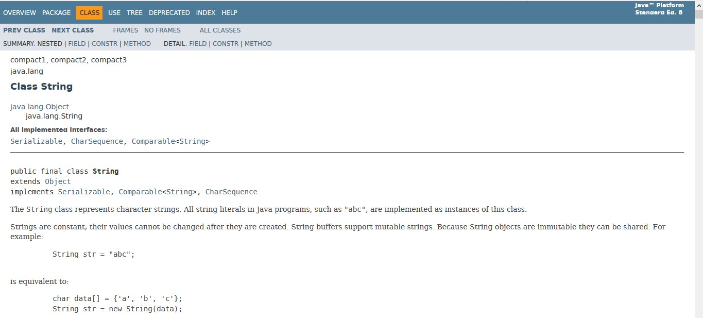

# **Tutorial 9: Packaging & Java API**

Dasar-dasar Pemrograman 2 - CSGE601021 | Fakultas Ilmu Komputer, Universitas Indonesia, Semester Genap 2018/2019

**Dibuat oleh: AFAI, dimodifikasi dari Tutorial DDP2 2017**

* * *
Selama ini, pengerjaan tutorial anda lakukan dengan mengimplementasikan sendiri sebagian besar program yang diperlukan. Mungkin anda tidak banyak memanfaatkan kode yang telah disediakan oleh bahasa pemrograman yang anda gunakan (Java), hanya sebagian kecil (Scanner untuk Input, System.out untuk output). Pada tutorial ini, anda tidak hanya diperbolehkan, namun juga sangat disarankan, untuk meng-explore  dan menggunakan library yang dimiliki oleh Java.

## **Tujuan Pembelajaran**
1. Memahami konsep Packaging
2. Dapat memahami & menggunakan dokumentasi Java API
3. Dapat menggunakan library yang telah disediakan Java
4. Dapat membuat komentar dokumentasi (Javadoc) yang cukup baik

### **Before You Start...**

### Before You Start...
**Jika Memiliki Akses ke Repository Lokal (Misal: Membawa Laptop Sendiri)**
1. Lakukan `git pull upstream master` dengan menggunakan Command Prompt pada folder repository lokal Anda.

**Jika Tidak Memiliki Akses ke Repository Lokal (Misal: Menggunakan Komputer Lab)**
1. Lakukan `git clone <link-repository-Anda>` dengan menggunakan Command Prompt untuk menginisiasi repository lokal berdasarkan
   repository online Anda.  
2. Arahkan Command Prompt ke folder repository lokal yang baru saja diinisiasi.
3. Lakukan `git remote add upstream <link-repository-DDP2>`
4. Lakukan `git pull upstream master`

## **Materi Tutorial**

Materi tutorial untuk lab kali ini tidak sebanyak materi-materi lab yang membahas Object-Oriented Programming (Lab 5, 6, 7, 8). 

### **Packaging**

Pada beberapa tutorial sebelumnya, anda tentunya telah menggunakan deklarasi package pada class-class yang anda buat. Contohnya deklarasi berikut:
```java
package something;

public class A{
	// ...
}
```

 Namun, apa sih package itu? Untuk apa kita perlu package?

 
#### **Definisi**
(Dikutip dan diterjemahkan dari [tutorial Java pada Oracle](https://docs.oracle.com/javase/tutorial/java/package/packages.html)):
	"Suatu _package_ adalah pengelompokan sejumlah _type_ (Class/Interface/dll) yang berkaitan, menyediakan proteksi akses dan manajemen _name space_"

Kita dapatkan dari sini bahwa suatu package kita gunakan untuk mengelompokkan sejumlah Class/Interface/sebagainya yang saling berkaitan. Tentunya dapat dilihat bahwa ini akan bermanfaat bila kita membuat suatu program yang memerlukan banyak sekali class, sehingga kita perlu tahu class-class mana saja yang berkaitan.

Disebutkan juga bahwa penggunaan package "_menyediakan proteksi akses_". Apa maksudnya?
Kita coba ingat-ingat lagi materi yang telah diberikan pada Lab 4, mengenai **access specifier**. Singkat saja, ada 4 access specifier di Java. Ketentuannya mengenai access specifier yaitu:

| **Access modifier** | **Class** | **Package**  | **Subclass** | **Global** |
| --- | :---: | :---: | :---: | :---: |
| private | ✅ | ❎ | ❎ | ❎ |
| default | ✅ | ✅ | ❎ | ❎ |      
| protected | ✅ | ✅ | ✅ | ❎ |  
| public | ✅ | ✅ | ✅ | ✅ |
✅ : Bisa diakses

❎ : Tidak bisa diakses

Contoh baca: sesuatu (variable/method/etc) dengan access specifier _default_ hanya dapat diakses dari class itu sendiri atau dari package yang sama, namun tidak dapat diakses dari subclassnya (bila tidak dari package yang sama), ataupun dari global (class lain yang bukan dari package yang sama)

Dengan memanfaatkan packaging, sesuatu yang access specifiernya kita jadikan default hanya dapat diakses dari class itu sendiri atau dari package yang sama. Kita bisa manfaatkan ini untuk kasus-kasus di mana suatu informasi (variable misalnya) hanya boleh diakses dan diubah oleh class-class pada package yang sama. (Ingat: default didapatkan dengan tidak menuliskan access specifier pada deklarasi variable/method/etc-nya. _keyword_ Java *default* digunakan bukan sebagai access specifier)

Selain itu, disebutkan juga bahwa package "menyediakan manajemen _name space_". Apa yang dimaksud dari pernyataan ini? Sebenarnya cukup sederhana. 
*Nama suatu tipe (class/interface/dll) tidak akan _conflict_ dengan nama yang sama pada package lain*. Contohnya adalah apabila kita mendeklarasikan suatu class Human pada package lab7 dan kita deklarasikan Human pada package lab8. Hal ini tidak masalah karena kedua class tersebut berada pada package yang berbeda.

#### **Deklarasi & Penamaan**
Untuk mendeklarasikan suatu class berada pada suatu package, digunakan statement berikut:
```java
package <namaPackage>;
```
Deklarasi ini harus diletakkan pada awal suatu source code (sebelum import statement ataupun header class)

Penamaan package, secara sintaks, sama seperti penamaan pada umumnya dalam Java - **bebas** (selama tidak diawali angka dan bukan merupakan _reserved keyword_ (public,int,default,dll)). Walaupun begitu, tentunya ada _best practice_ untuk penamaan. Konvensi penamaan yang kita gunakan adalah [Google Java Style](https://google.github.io/styleguide/javaguide.html), dimana disebutkan bahwa nama package ditulis dengan huruf kecil semua, dengan beberapa kata disambung (contoh: org.example.javacoding).

#### **Menggunakan Type dari Package Lain**
Misalkan kita memiliki suatu class **Mahasiswa** diletakkan pada package **universitas**. Kita ingin menggunakan class tersebut pada suatu class yang kita buat di package lain. Ada 2 cara untuk menggunakan class tersebut (di [sini](https://docs.oracle.com/javase/tutorial/java/package/usepkgs.html) disebutkan bahwa ada 3 cara, namun kami menganggap cara ke-2 dan 3 sebagai cara yang serupa):
1. Menggunakan nama lengkap class tersebut setiap kali digunakan
Nama lengkap yang dimaksud di sini adalah nama class tersebut lengkap dengan packagenya, sehingga class Mahasiswa tersebut kita sebut sebagai universitas.Mahasiswa. Contoh penggunaannya adalah:
```
universitas.Mahasiswa mhs = new universitas.Mahasiswa(...);
...
public static universitas.Mahasiswa getMahasiswa() {
	...
}
```
Cara ini bisa digunakan, namun repot tentunya bila kita perlu mengetik nama package secara keseluruhan hingga nama classnya. Bagaimana jika classnya terletak dalam sub-package yang cukup dalam? Bagaimana jika memerlukan banyak class dari package tersebut? (contoh: java.util.function.Function, java.io.BufferedReader, dll)
Ini membawa kita pada cara ke-2:
2. Menggunakan _import statement_
Bila kita ingin menggunakan suatu class dari package lain, kita dapat _meng-import_ class tersebut agar dapat kita gunakan tanpa menyebutkan nama package dari class tersebut. Contohnya pada class mahasiswa tadi, kita dapat menggunakan:
```
import universitas.Mahasiswa;
```
Kemudian kita dapat menggunakan class Mahasiswa tersebut:
```
Mahasiswa mhs = new Mahasiswa();
```
(Access specifier masih berlaku di sini. Kita tetap tidak bisa mengakses variable/method/dll yang dideklarasikan _default_)
Bila kita memerlukan banyak class dari package yang sama, kita lakukan import pada statement terpisah:
```java
import universitas.Mahasiswa;
import universitas.Staff;
import universitas.Dosen;
...
```
Alternatifnya, kita dapat menggunakan karakter _wildcard_ untuk mengimport semua class/interface/dll pada package tersebut:
```java
import universitas.*;
```
(cara import ini tidak melibatkan sub-package yang terdapat dalam package yang diimport. Sub-package tersebut perlu diimport pada statement terpisah)

**Catatan**: Class/Interface yang terdapat pada package java.lang tidak perlu diimport dan dapat langsung digunakan. Contoh class yang terdapat pada package ini adalah Math, System, dan String.

#### **Menyusun File**
File yang berada dalam suatu package diletakkan dalam folder/direktori yang namanya sesuai dengan nama package tersebut. Agar lebih jelas, contohnya kita memiliki class:
```java
Mahasiswa (package universitas)
Dosen (package universitas)
MataKuliah (package universitas.kuliah)
MataKuliahMinat (package universitas.kuliah)
Masjid (package universitas.fasilitas)
Asrama (package universitas.fasilitas)
```
Maka susunan filenya adalah:
```
./
...universitas/
.....Mahasiswa.java
.....Dosen.java
.....kuliah/
.......MataKuliah.java
.......MataKuliahMinat.java
.....fasilitas/
.......Masjid.java
.......Asrama.java
```

Tutorial selengkapnya dapat dibaca di [The Java(tm) Tutorials - Packages](https://docs.oracle.com/javase/tutorial/java/package/index.html)

### **Java API**

Sebentar, sebentar.... API? Apa itu? Kebakaran? _Java kebakaran?_ **Java mbakar?**

#### **Apa itu API? (Penjelasan Singkat)**

Tenang, tenang! Bukan kebakaran atau api! API yang kita maksud di sini itu singkatan dari **Application Programming Interface**. Untuk dapat lebih mengerti apa itu API, kita umpamakan saja menu pada restoran, atau layanan-layanan pada hotel, adalah API dari suatu aplikasi. Kita dapat melihat apa saja yang bisa kita pesan atau minta, kemudian restoran/hotel tersebut akan memberikan layanan yang kita minta. Kita tidak perlu tahu apa yang terjadi di balik sana (misalnya bagaimana menyiapkan makanannya, bagaimana memilih orang untuk mengurus _room service_). Kita menyebutkan apa yang kita mau (dan membayar) dan kita terima layanan tersebut. Itu saja. (Penjelasan didapatkan dari [How-To Geek: What is an API?](https://www.howtogeek.com/343877/what-is-an-api/), dengan sedikit tambahan. Mungkin bukan analogi yang baik ataupun tepat, namun diharapkan dapat lebih memberikan gambaran).

#### **Pengenalan API di Java**

Seperti halnya yang telah disebutkan, Java juga memiliki API yang dapat kita manfaatkan agar dapat mempermudah pekerjaan kita. Sebagai contoh, bila kita ingin melakukan operasi matematika: pemangkatan, kita dapat menggunakan **Math.pow()** yang dimiliki Java. Bila kita ingin menulis ke file atau membaca dari file, Java memiliki package **java.io** yang di dalamnya terdapat class-class yang dapat melakukan hal tersebut. Kita ingin mengurutkan sebuah Array atau ArrayList? Java juga punya! Pertanyaannya, **bagaimana kita mempelajarinya, memahaminya, dan tentunya, menggunakannya?**

#### **Dokumentasi API Java**

Oracle menyediakan [dokumentasi Java API](https://docs.oracle.com/javase/8/docs/api/) yang di dalamnya menjelaskan berbagai macam package, class, dan sebagainya yang dimiliki Java. Contoh pada link sebelumnya adalah dokumentasi untuk Java 8 API. Dokumentasi untuk versi Java lainnya (Java 7 atau Java 9 misalnya) juga ada dan dapat dicari.

#### **Contoh: String dalam Java**

Sebagai contoh, kita dapat melihat dokumentasi untuk class [java.lang.String](https://docs.oracle.com/javase/8/docs/api/java/lang/String.html).

Pada halaman tersebut, kita dapat melihat berbagai macam informasi terkait class tersebut (macam-macam Constructor yang dapat digunakan, method-method yang tersedia, dll). Kita dapat melihat penjelasan terkait tiap method, return typenya, dan sebagainya. 
Kita ambil contoh pada method [charAt()](https://docs.oracle.com/javase/8/docs/api/java/lang/String.html#charAt-int-).
")
Dijelaskan apa yang dilakukan oleh method tersebut ("_Returns the char value at the specified index. An index ranges from 0 to length() - 1. The first char value of the sequence is at index 0, the next at index 1, and so on, as for array indexing. If the char value specified by the index is a surrogate, the surrogate value is returned._"). Selain itu dijelaskan pula parameter yang digunakan ("_index - the index of the char value._") serta return valuenya ("_the char value at the specified index of this string. The first char value is at index 0._"). Di awal tiap penjelasan, diberikan header dari method yang dijelaskan ("public char charAt(int index)") sehingga jelas access specifiernya (kita tahu siapa yang bisa mengakses), static atau non-static (jelas apakah perlu object atau tidak agar dapat digunakan), return typenya, nama methodnya (jelas...), serta tipe dan urutan parameternya. Terakhir, terdapat penjelasan mengenai _Exception_ (yang akan anda segera pelajari) terkait method tersebut.

#### **Dokumentasi Kode: Komentar Javadoc**

Kita sudah melihat contoh dokumentasi API milik Java. Kita lihat bahwa dokumentasi tersebut sangat berkaitan dengan bagaimana kode umumnya didefinisikan (ada header dari method, ada nama argumen-argumen dari parameter, ada return type dan value, dan sebagainya). Nah, mungkin saja ada yang bertanya, apa dokumentasi tersebut dibuat manual pada halaman web, terpisah dari kode? Apa header dari method, parameter, dan sebagainya yang ada pada dokumentasi dicocokkan secara manual dengan kode yang ada?

Jawabannya **tidak**! Dokumentasi tersebut sebenarnya **secara otomatis dibuat berdasarkan komentar tertentu yang ada pada source code**. Komentar yang bagaimana? Kita sebut komentar yang dijadikan dokumentasi tersebut adalah **komentar Javadoc**. Bagaimana menuliskan komentar tersebut pada kode?

Ada 3 macam komentar pada Java. Komentar jenis pertama dapat kita sebut _line comment_, diawali dengan "//". Dari awal komentar tersebut hingga akhir baris dianggap sebagai komentar.
```java
// this is a line comment
```
Komentar jenis kedua dapat kita sebut _block comment_, komentar yang diawali "/* " dan diakhiri "*/". Dari pembuka hingga penutup, semuanya dianggap komentar, walaupun terpisah pada beberapa baris.
```java
/* this
   is
   a
   block
   comment
   
   not sparta
*/
```
Komentar jenis ketiga yaitu _Javadoc comment_, diawali dengan "/**" dan diakhiri dengan "*/". Seperti block comment, dimulai dari pembuka hingga penutup semuanya dianggap komentar walaupun terpisah pada beberapa baris
```java
/** this
    is
	a
	Javadoc
	comment
*/
```
Sekarang kita tahu 3 cara menuliskan comment pada java. Agar dokumentasi seperti yang tadi kita lihat dapat terbentuk, dimana kita harus meletakkan Javadoc comment, dan apa saja yang ditulis?

Sebuah Javadoc comment dituliskan tepat sebelum header dari **class/interface, instance/class variable, constructor, dan method**. Suatu Javadoc comment umumnya terdiri dari 2 bagian: **deskripsi** dan **_block tag_**. Komentar Javadoc ditulis seperti menulis HTML (sehingga terdapat tag seperti `<code>`, dll). Berikut contoh komentar Javadoc pada method charAt(int) milik String (diambil dari [GrepCode: java.lang.String](http://grepcode.com/file_/repository.grepcode.com/java/root/jdk/openjdk/6-b14/java/lang/String.java/?v=source)):
")
Terlihat bahwa komentar tersebut menjelaskan apa yang dilakukan oleh charAt(int), dan apa yang terdapat pada komentar tersebut sesuai dengan apa yang ada pada dokumentasi. Selain itu, terdapat juga baris-baris yang menyatakan "`param ....`", "`return ....`". Baris baris tersebut diawali dengan tag (`param`, `return`, ....) dan dilanjutkan dengan penjelasan. Untuk tag `param`, perlu diikuti dengan nama argumen (pada kasus charAt, nama argumennya adalah _index_), kemudian diikuti penjelasan. Pada `return`, langsung diikuti oleh penjelasan.

Penjelasan lebih lengkap terkait penulisan dan penggunaan komentar Javadoc dapat dilihat pada [Oracle - How to Write Doc Comments for the Javadoc Tool](http://www.oracle.com/technetwork/articles/java/index-137868.html).

## **Soal Tutorial: Cat Society V2.0**

### **What's the story?**

Amir yang sedang tidak ada kerjaan, diundang oleh temannya Caca untuk menjadi pemateri di sebuah tutorial DDP2 mengenai package dan API pada java.
Namun, ternyata mahasiswa yang mengikuti tutorial tersebut belum mempelajari mengenai package dan API di java. Kemudian, Amir teringat bahwa
program yang telah ia buat sebelumnya, 'CatSociety' sudah pernah dipublikasikan dan terkenal di kalangan para mahasiswa DDP2.
Amir pun memutuskan untuk menggunakan kembali program tersebut untuk membuat soal tutorial yang lebih mudah dimengerti.

Ternyata, program tersebut sudah menggunakan prinsip packaging, file-file java yang memiliki karakteristik yang sama, sebagai
character dalam program `CatSociety` dikumpulkan menjadi satu, menjadi package `character`. Pada soal tutorial yang dibuat oleh Amir,
Amir meminta mahasiswa membuat sebuah package baru, `characterv2` yang berisi modifikasi dari character-character di package `character`.
Amir ingin kalian mengubah character-character tersebut, agar setiap data dan operasi yang melibatkan angka, dapat digunakan untuk
angka integer > 10000000000000000000000000000000000000000000000000000000000000000000000000000.

Berikut daftar perubahan mengenai operasi angka:
1. Semua tipe data int, harus diubah agar dapat melakukan operasi untuk angka integer > 10000000000000000000000000000000000000000000000000000000000000000000000000000
2. Sleep pada Kucing.java, menambahkan health sebanyak 200000000000000000000000000000000000
3. PayTax pada KucingRakyat.java, mengurangi health sebanyak 200000000000000000000000000000000000

Tambahan:
1. Semua constructor menerima parameter data angka integer dalam bentuk string, parsing ke bentuk tipe data yang baru
dapat dilakukan setelahnya.
Contoh:
```java
public Kucing(String name, String health, String power){
        //do something
    }
```

>Hint : Gunakan java API, kalian dapat melihat dokumentasi API pada javadoc dan cari API yang kalian butuhkan

Mempertimbangkan mungkin ada mahasiswa yang belum tahu secara detail mengenai CatSociety V1.0, Amir telah mempersiapkan kode yang
dapat digunakan oleh mahasiswa di [`contoh kode cat society`][Code]

Setelah kalian mengganti tipe data, kalian dapat melihat bahwa operasi biasa seperti +,-,*,/,<,<=,>,>=,== tidak dapat digunakan
pada tipe data tersebut, kalian dapat melihat dokumentasi API tersebut untuk mengetahui bagaimana cara melakukan
operasi-operasi tersebut. 

#### Contoh Output

Jalankan [`CatSocietyv2.java`][catSocietyV2]

Output seharusnya adalah :
```
Nama : Aya
Health : 10000000000000000000000000000000000000000000000000000000000000000000000000000
Power : 30000000000000000000000000000000
Title : Empress

Nama : Rian
Health : 120000000000000000000000000000000000000000000000000000000000000000000000000000
Power : 30000000000000000000000000000000

Nama : Salsa
Health : 80000000000000000000000000000000000000000000000000000000000000000000000000000
Power : 20000000000000000000000000000000

Nama : Aya
Health : 9999999999999999999999999999999999999999999920000000000000000000000000000000
Power : 30000000000000000000000000000000
Title : Empress

Nama : Rian
Health : 120000000000000000000000000000000000000000000000000000000000000000000000000000
Power : 30000000000000000000000000000000

Nama : Salsa
Health : 79999999999999999999999999999999999999999999970000000000000000000000000000000
Power : 20000000000000000000000000000000

Nama : Aya
Health : 10000000000000000000000000000000000000000199920000000000000000000000000000000
Power : 30000000000000000000000000000000
Title : Empress

Nama : Rian
Health : 120000000000000000000000000000000000000000200000000000000000000000000000000000
Power : 30000000000000000000000000000000

Nama : Salsa
Health : 80000000000000000000000000000000000000000199970000000000000000000000000000000
Power : 20000000000000000000000000000000

Nama : Rian
Health : 120000000000000000000000000000000000000000000000000000000000000000000000000000
Power : 30000000000000000000000000000000

Nama : Salsa
Health : 79999999999999999999999999999999999999999999970000000000000000000000000000000
Power : 20000000000000000000000000000000

Nama : Rian
Health : 0
Power : 30000000000000000000000000000000

Nama : Salsa
Health : 0
Power : 20000000000000000000000000000000
```


### Bonus

Karena sudah merupakan hal yang umum di masyarakat untuk membanding-bandingkan, Amir ingin Kucing yang dibuatnya
juga bisa dibandingkan, untuk itu, pada soal tutorialnya Amir meminta mahasiswa agar class `Kucing.java` mengiplements
sebuah interface API dari java yang bernama [`Comparable`][comparable], dan mengimplementasikan method `compareTo` dari interface
tersebut. 

Ketentuan perbandingan adalah sebagai berikut:
1. Bandingkan health dari kucing
2. Kucing A dianggap lebih dari kucing B apabila health A > health B
3. Kucing A dianggap kurang dari kucing B apabila health A < health B
4. Jika health sama, bandingkan power dari kucing
5. Jika health sama, Kucing A dianggap lebih dari kucing B apabila power A > power B
6. Jika health sama, Kucing A dianggap kurang dari kucing B apabila power A < power B
7. Jika health dan power sama, maka kedua kucing dianggap sama

>Kenapa mengimplements Comparable ?
>Ada banyak kegunaan yang kita dapatkan dengan mengimplements Comparable, banyak API di java yang menggunakan
>compareTo dari Comparable sebagai cara membandingkan 2 buah object, sehingga jika kita ingin menggunakan
>API tersebut, kita harus mengimplements Comparable, sebagai contoh:  
>Collections.sort dan Collections.binarySearch  
>Arrays.sort dan Arrays.binarySearch  

## Checklist

Isi kurung siku komponen dengan x untuk menceklis komponen.

### Komponen Wajib | 100 Poin

- [ ] **Membuat  setiap data dan operasi yang melibatkan angka, dapat digunakan untuk 
angka > 10000000000000000000000000000000000000000000000000000000000000000000000000000**

-----
### Komponen Bonus | 10 Poin

- [ ] **Mengimplementasikan compareTo**

### **Woah, apa ini !?**

Ketika kalian meng-push hasil kerja kalian, kalian akan sadar bahwa ada logo cross merah atau centang hijau di samping hasil kerja kalian.


Kalian mungkin memperhatikan bahwa kita mulai memakai sistem git sejak semester 2, mengikuti kakak angkatan kalian yang baru mulai memakai sistem git sejak semester 3. Salah satu guna dari menggunakan git adalah kita bisa menggunakan fitur Continuous Integration?

Apa itu Continuous Integration? Continuous Integration adalah konsep di mana ketika kalian push, hasil push kalian langsung di build (compile) dan di test (uji langsung). Jika gagal, kalian akan diberitahu.

Bagian Build baru akan dijelaskan di mata kuliah Advanced Programming. Kalian hanya perlu mengetahui bagian test.

Sistem yang digunakan untuk mengetest di Java bernama JUnit. Kita bisa menggunakan framework JUnit untuk mengetes secara langsung (tanpa harus print di command line). Untuk sekarang, kalian tidak perlu tahu cara kerja JUnit.

Kamu dapat memeriksa hasil kerja Junit di tab Commit. Tekan logo centang hijau atau cross merah untuk memeriksa detail lebih lanjut.


Ketika kamu menekan logo tersebut, kamu akan memeriksa rangkuman dari tes tersebut yang memiliki dua lingkaran.

Jika lingkaran pertama cross, maka program kamu gagal karena compile error.
Jika lingkaran pertama centang hijau tetapi lingkaran kedua cross, maka program kamu tidak akurat.
Jika kedua lingkaran centang, berati program kamu sudah baik.


Kamu dapat menekan tombol cross merah atau centang hijau untuk melihat hasil lebih lanjut. Sebagai contoh, jika kalain mendapat cross merah di lingkaran kedua, kamu dapat menemkan cross merah kedua untuk melihat test case mana program kalian tidak akurat.

[Code]: lab_solution_examples/solution_lab_7
[comparable]: https://docs.oracle.com/javase/8/docs/api/java/lang/Comparable.html
[catSocietyV2]: lab_9/src/main/java